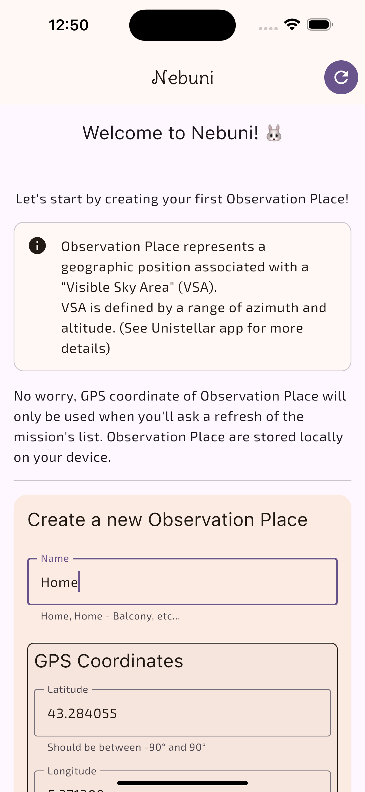
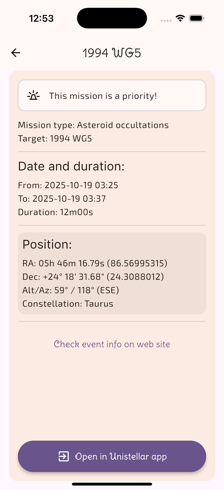

 

Hi, and welcome to this repo of Nebuni app!

# What's Nebuni?
Nebuni is an open source cross-platform app helping to use your Unistellar's telescope.

The first feature will be to fetch science missions, storing them locally for offline use and with an option to open official Unistellar's app science page, like if using the science website.

## Beta versions
### iOS and iPadOS
For iOS users, go to this [link](https://testflight.apple.com/join/NMbXYvmA), follow instruction provide by Apple and join the beta program of Nebuni 🐰

### Android phone and tablet
For Android users, go to this [link](https://play.google.com/store/apps/details?id=com.domnis.nebuni), accept conditions if needed and install the beta version of Nebuni's app! 🐰

## 📸 Screenshots

  
  
  

# Why Nebuni?
I'm a user of Unistellar's telescope and one thing I missed to do more science is a tool to help me find missions, especially when I'm connected to my telescope, without internet access.

I also want to try Kotlin and Compose multiplatform development framework for mobile app.

So I joined both and start working on Nebuni!

# No, I mean... WHY Nebuni? Why this name?
Oh... I see. In fact, as a side project, I don't really think about a name of product, or something. But be real, "Unistellar's science mission fetching app" is a bit long, difficult to remind and limited in terms of future development, right?
So... I brainstorm few minutes...

Nebula was deep sky object I prefer (sooo colorful!!! 🤩)

Nebula could be a good starting point to link to "Unistellar", or, more globally, "Universe", "Unity", etc... like "NebUnistellar" or "NebUniverse"...

And, in shorter way... Nebuni make me think about... a bunny 🐰! (So, in same time, I got a name AND a logo, pretty cool, right? 😎)

Also, Lepus is a small constellation, associated to Orion and his dogs (for story), but fainter than them... Like Nebuni, a smaller app than Unistellar's one (or any other company if some feature could be compatible to all of them)

# Release
Nebuni will be released on Apple's App Store and Google Play Store when the real v1 will be reach.

Since that, a beta testing program will be lunch as soon as possible so it will be easy for all to test the app!

# Roadmap
Here are some elements to be added inside the app to have a good experience with the main feature currently focused.

- [x] Call and fetch Unistellar's science API
- [x] Add input to define GPS coordinates (and use them to make API calls) 
- [x] Open Unistellar's app by using providing deeplink
- [x] Save GPS coordinates for next app use
- [ ] Save API result locally for offline use
- [ ] Add screen to configure Altitude and Azimuth range
- [ ] Add option to filter and group missions (by type, start date,...)

# License
Copyright (C) 2025 Sylvain

This program is free software: you can redistribute it and/or modify
it under the terms of the GNU Affero General Public License as published by
the Free Software Foundation, either version 3 of the License, or
(at your option) any later version.

This program is distributed in the hope that it will be useful,
but WITHOUT ANY WARRANTY; without even the implied warranty of
MERCHANTABILITY or FITNESS FOR A PARTICULAR PURPOSE.  See the
GNU Affero General Public License for more details.

You should have received a copy of the GNU Affero General Public License
along with this program.  If not, see <http://www.gnu.org/licenses/>.